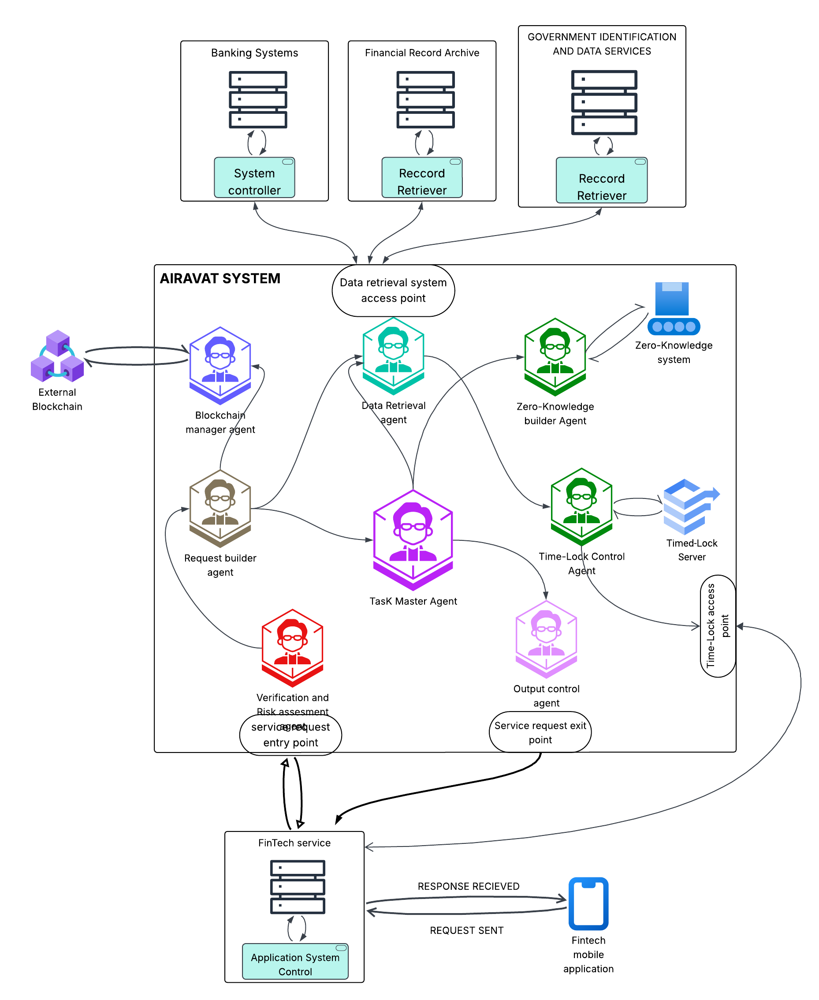

# Airavat

**Airavat** is a proof-of-concept developed for the SuRaksha hackathon under Theme 2: _Securing Sensitive Customer Data in Fintech Ecosystems with Responsible Data Sharing and Privacy Protection_. It leverages AI agents, zero-trust architecture, blockchain, and privacy-enhancing technologies to protect sensitive customer data (e.g., bank details, transaction histories) while enabling secure and compliant data sharing in fintech ecosystems.

## Table of Contents

- [Airavat](#airavat)
  - [Table of Contents](#table-of-contents)
  - [Overview](#overview)
  - [Architecture](#architecture)
    - [🔷 **System Architecture**](#-system-architecture)
    - [🔶 **Micro-Architecture**](#-micro-architecture)
  - [Components](#components)
  - [Directory Structure](#directory-structure)
  - [Setup](#setup)
  - [Usage](#usage)
  - [Contributing](#contributing)
  - [License](#license)

## Overview

Airavat addresses the challenge of securing sensitive customer data in fintech platforms, particularly during third-party data sharing. It ensures compliance with regulations like GDPR and India's DPDP Act, minimizes data exposure, enforces usage boundaries, and fosters user trust through transparency and ethical data handling.

Airavat includes two secure dashboards for real-time interaction and control:

- **User Dashboard**: [https://airavat-userdash.vercel.app/](https://airavat-userdash.vercel.app/) – Allows customers to manage consent, view shared data, and monitor access history.
- **Bank Dashboard**: [https://airavat-alpha.vercel.app/](https://airavat-alpha.vercel.app/) – Enables financial institutions to handle data requests, risk assessments, and policy enforcement.

## Architecture

Airavat employs a multi-agent system where each agent performs a specific role in the secure data-sharing workflow:

- **Verification and Risk Assessment Agent (VRA)**: Verifies requests and assesses risks using machine learning.
- **Request Builder Agent (RBA)**: Determines what data to share based on request analysis.
- **Task Master Agent (TMA)**: Orchestrates the workflow and coordinates agents.
- **Data Retrieval Agent (DRA)**: Handles secure data lookup and retrieval.
- **Zero-Knowledge Builder Agent (ZKBA)**: Implements zero-knowledge protocols for privacy.
- **Blockchain Builder Agent (BBA)**: Logs transactions to a blockchain for auditability.
- **Output Control Agent (OCA)**: Formats and delivers responses.
- **Time-Lock Server Agent (TLSA)**: Performs secondary risk checks for the Time-Lock Server.
- **Time-Lock Server (TLS)**: Stores data with time-bound access.

Below are two diagrams that illustrate Airavat’s architecture from both a system-wide and agent-level perspective.
### 🔷 **System Architecture**



This diagram provides a high-level view of how different components (user dashboard, bank dashboard, agents, blockchain, etc.) interact within the Airavat ecosystem.

### 🔶 **Micro-Architecture**

**[📄 View Micro-Architecture Diagram (PDF)](documentation/images/micro_arch.pdf)**

This detailed PDF outlines internal agent interactions, data flow logic, and privacy-preserving protocol layers.

## Components

- **AI Agents**: Built with LangChain for policy enforcement and anomaly detection.
- **Zero-Trust Architecture**: Enforces strict access control with continuous verification.
- **Blockchain**: Uses Hyperledger Fabric for immutable audit trails.
- **Privacy-Enhancing Technologies**: Incorporates differential privacy (OpenDP) and homomorphic encryption (Microsoft SEAL).
- **User Interface**: Provides consent management and admin dashboards.

## Directory Structure

```
airavat/
├── agents/
│   ├── vra/            # Verification and Risk Assessment Agent
│   ├── rba/            # Request Builder Agent
│   ├── tma/            # Task Master Agent
│   ├── dra/            # Data Retrieval Agent
│   ├── zkba/           # Zero-Knowledge Builder Agent
│   ├── bba/            # Blockchain Builder Agent
│   ├── oca/            # Output Control Agent
│   ├── tlsa/           # Time-Lock Server Agent
├── blockchain/         # Hyperledger Fabric integration
├── privacy/            # Privacy-enhancing tech (OpenDP, SEAL)
├── ui/                 # User interface for consent and admin dashboards
├── utils/              # Shared utilities and helpers
├── tests/              # Test cases and synthetic data
├── docs/               # Documentation
├── requirements.txt    # Python dependencies
├── .gitignore         # Git ignore file
└── README.md          # Project readme
```

## Setup

Follow these steps to set up the Airavat development environment:

1. **Clone the Repository**:

   ```bash
   git clone https://github.com/justAbhinav/Airavat
   cd Airavat
   ```

2. **Set Up Python Virtual Environment**:

   ```bash
   python3 -m venv venv
   source venv/bin/activate  # On Windows: venv\Scripts\activate
   pip install -r requirements.txt
   ```

3. **Install Dependencies**:

   - Install Docker for Hyperledger Fabric:
     ```bash
     curl -fsSL https://get.docker.com -o get-docker.sh
     sh get-docker.sh
     ```
   - Install Docker Compose:
     ```bash
     sudo apt-get install docker-compose  # Or equivalent for your OS
     ```

4. **Configure Environment Variables**:

   - Copy `.env.example` to `.env` and update with required values (e.g., API keys, blockchain config).

5. **Run Blockchain Network**:
   - Navigate to `blockchain/` and follow the Hyperledger Fabric setup instructions (TBD in `blockchain/README.md`).

## Usage

- **Start the System**:
  ```bash
  python main.py  # Placeholder; update with actual startup script
  ```
- **Testing**: Use synthetic data in `tests/` to simulate requests and validate functionality.
- **Monitoring**: Check logs and blockchain entries for auditing.

## Contributing

Contributions are welcome! Please see [CONTRIBUTING.md](CONTRIBUTING.md) for guidelines.

## License

This project is licensed under the [MIT License](LICENSE).
